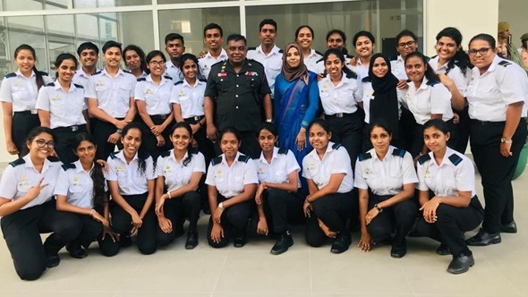

# “STEP INTO THE WORLD OF DATA – DRIVEN INSIGHTS AND INNOVATIONS”

Data Odyssey, the groundbreaking exhibition, Introducing the
Future of Data Science and Communication, where you will be able
to witness the future of data science communication and explore
the boundless opportunities that await, paving the way for a new
generation of data science trailblazers in Sri Lanka and beyond.
Join us at the groundbreaking exhibition to discover the
revolutionary degree program, BSc. Applied Data Science
Communication, offered exclusively by the Faculty of Management
and Social Sciences and Humanities at General Sir John Kotelawala
Defence University.

As the first and only degree of its
kind in Sri Lanka, this innovative course is setting new standards
in preparing students for the dynamic world of data science. With
a successful collaboration with the 16th International Research
Conference at the Kotelawala Defence University, the DatAInspire,
a recently established AI and Data Science club hosted its first
ever exhibition, “Data Odyssey” on the 08th of September 2023,
exploring the cutting-edge algorithms, machine learning models,
and visualizations that unravel complex patterns hidden within
data. Journeying through the realm of predictive analytics,
natural language processing, and AI applications across various
industries while engaging with the interactive displays learning
how data science is transforming businesses and society.

Ms.
Chamodhi Wickramasinghe is coordinating the Data Odyssey, the AI
and Data Science Exhibition along with Dr. Charith Silva, Adjunct
Senior Lecturer, Department of Languages and Dr. Bimali
Indrarathne Visiting Lecturer, Department of Languages.Mr. Pasindu
Marasingha, Lecturer at University of Colombo School of Computing;
Ms. Gayani Rupasinghe, Department of Computation and Intelligent
Systems of the University of Colombo; Dr. Samantha Matharaarachchi
of University of Colombo along with Captain (Ret.) Udaya Dampage,
Senior lecturer from the Faculty of Engineering and Mr. Kasun from
the Faculty of Engineering of KDU were the panel of judges who
determined the winners who won the 1st, 2nd and 3rd places by the
end of the day.The First place was won by Team BIN TECH EXPLORE
for the Smart Intelligent Segregator; the Second place was won by
Team LUMOS for the Smart Street Light System and finally the Third
place was won by Team TROJANS for the Sensory Safe Cap for
presenting and exhibiting their remarkable utilization of AI and
Data Science in their findings and innovations.

Rear
Admiral HGU Dammika Kumara, VSV, USP, psc, MMaritimePol, BSc (DS)
the Vice Chancellor of KDU was the chief guest of the
event.Further, Mr. Kithsiri Amaratunga, the former Dean Faculty of
Management, Social Sciences and Humanities and Major Wimansha
Abeyawickrama (Head of the Department of Languages) were among the
distinguished gathering.From data exploration to actionable
insights, this exhibition showcased the power of data and its
potential to shape a brighter future.

## Images

