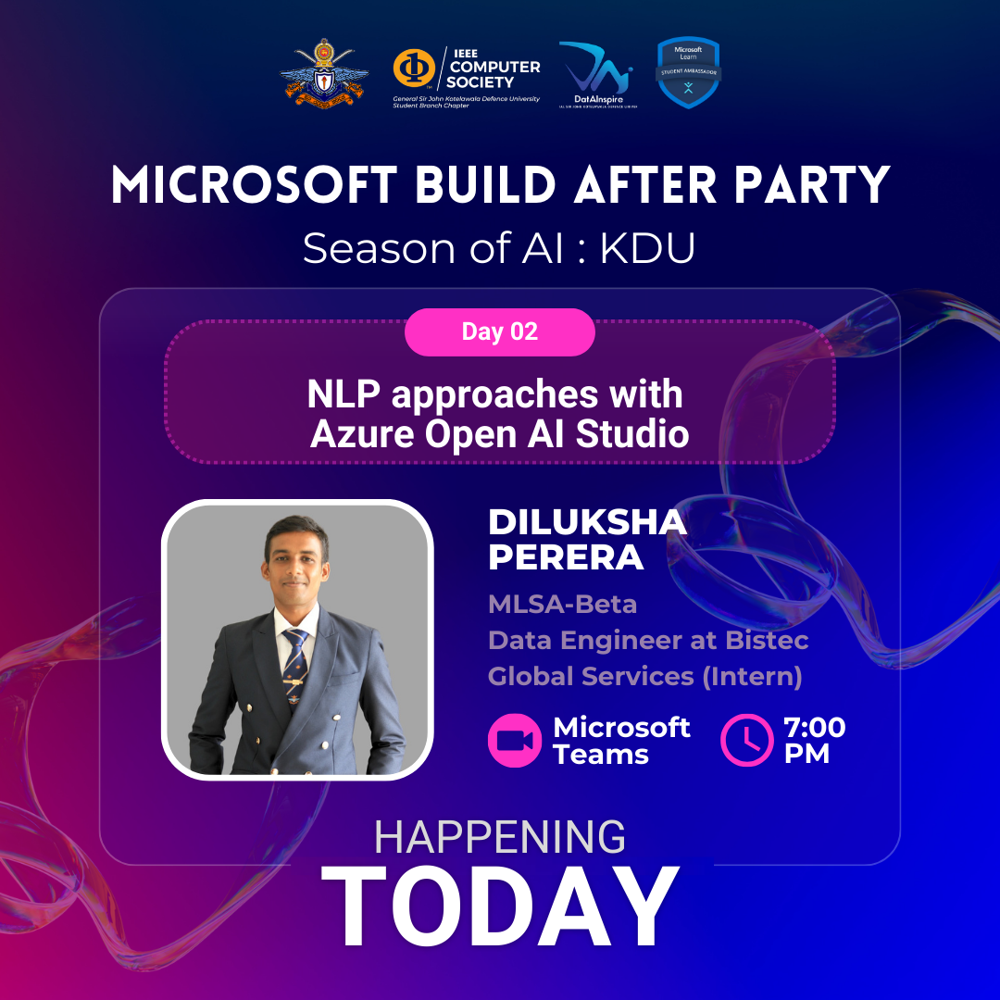
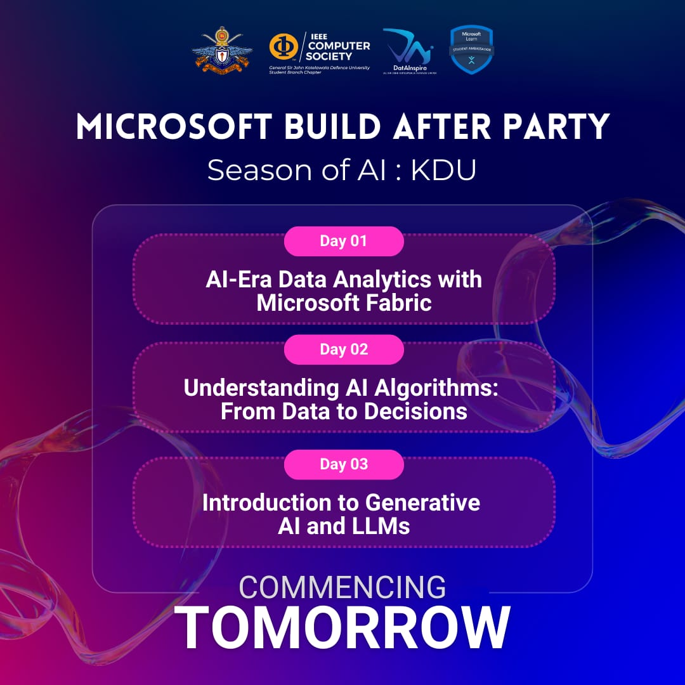
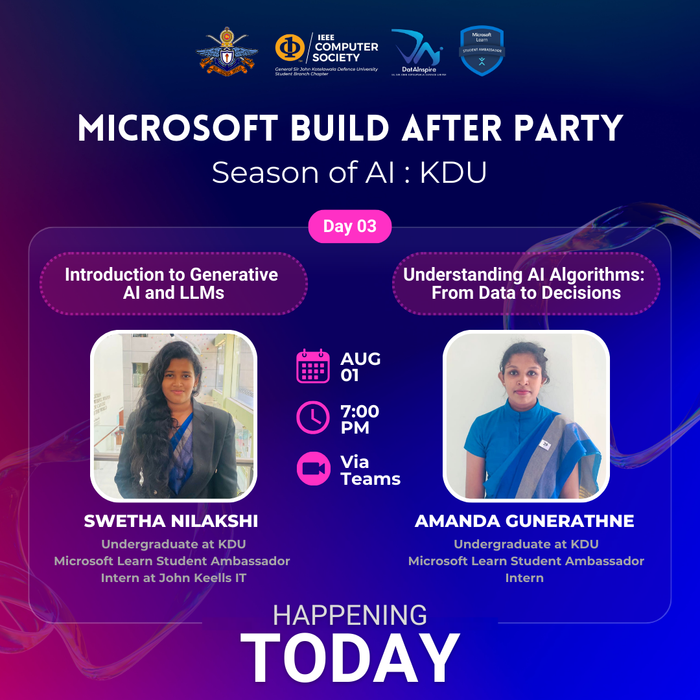
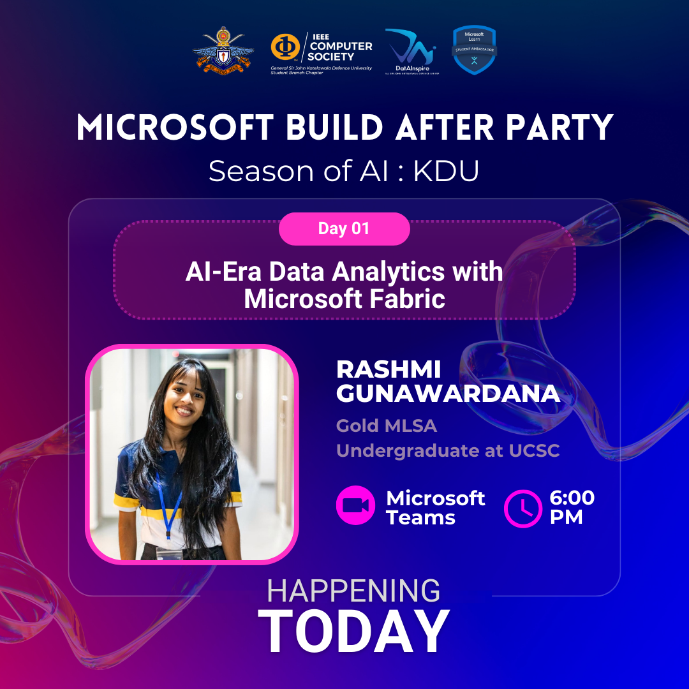

# Represent KDU in Style! Grab your exclusive AI & Data Science Club T-shirt NOW!

The AI and Data Science Club of KDU, in collaboration with the IEEE
Computer Society Student Chapter of KDU and Microsoft Learn Student Ambassadors, recently
hosted an inspiring AI session that brought together bright minds and cutting-edge topics. We extend our heartfelt thanks to everyone who participated and contributed to making this event a
remarkable success. Special appreciation goes to our esteemed speakers—Rashmi Gunawardana,
Diluksha Perera, Swetha Nilakshi, and Amanda Gunerathne—who enlightened us on Data
Analytics, NLP, Generative AI, and AI Algorithms. Your energy and engagement were truly the driving
forces behind the success of our event. Congratulations to our well-deserving prize winners, and
thank you to all participants for shaping the future of data science with your active involvement.
Stay tuned for more insightful sessions as we continue our journey into the fascinating world of
data science!

## Images

